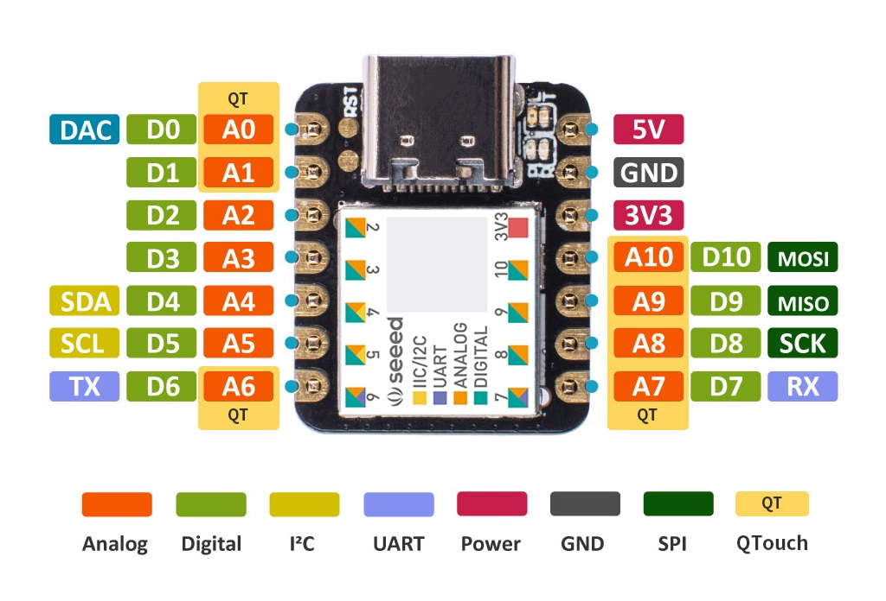

# **Guia Rápida Seeeduino Xiao**
Esta implementación de Aixt para dae soporte a la tarjeta SAMD21.

## Resumen
* *SAMD21, tiene 14 PIN, que se pueden usar para 11 interfaces digitales, 11 interfaces simuladas, 10 interfaces PWM (d1-d10), 1 pin de salida DAC D0, 1 interfaz de pad SWD, 1 interfaz I2C, 1 interfaz SPI, 1 Interfaz UART, Indicador de comunicación serial (T/R), Luz parpadeante (L) mediante multiplexación de pines. Los colores de los LED (Power,L,RX,TX) son verde, amarillo, azul y azul. Además, Seeed Studio XIAO SAMD21 tiene una interfaz tipo C que puede suministrar energía y descargar código. Hay dos botones de reinicio, puedes conectarl2os brevemente para reiniciar la placa.La definició de pines esta descrita en la tala de* Identificación de Pines.



## Datasheet
[Seeeduino Xiao SAMD21G18A-MU](https://files.seeedstudio.com/wiki/XIAO/Seeed-Studio-XIAO-Series-SOM-Datasheet.pdf)

## Identificación de Pines
Below are the ports used and their proper designations for programming:

Pin No. |Nombre                | Función 
--      |-----                 | ---
0       |D0-A0-DAC-QT0         | Analogo; Digital; Convertidor Analogo Digital;            Circuito integrado para botón capacitivo 
1       |D1-A1-QT1             | Analogo; Digital;                                         Circuito integrado para botón capacitivo  
2       |D2-A2                 | Analogo; Digital; 
3       |D3-A3                 | Analogo; Digital; 
4       |D4-A4-SDA(I2C)        | Analogo; Digital; Protocolo control de dispositivos(Transmisión de datos)
5       |D5-A5-SCL(I2C)        | Analogo; Digital; Protocolo control de dispositivos(Envio sincronismos de reloj) 
6       |D6-A6-TX-QT2          | Analogo; Digital; Comunicación Serial(Transmisor);        Circuito integrado para botón capacitivo
7       |D7-A7-RX-QT3          | Analogo; Digital; Comunicación Serial(Receptor);          Circuito integrado para botón capacitivo
8       |D8-A8-SCK(SPI)-QT4    | Analogo; Digital; Reloj serial;                           Circuito integrado para botón capacitivo
9       |D9-A9-MISO(SPI)-QT5   | Analogo; Digital; Protocolo de comunicación 4 hilos;      Circuito integrado para botón capacitivo 
10      |D10-A10-MOSI(SPI)-QT6 | Analogo; Digital; Protocolo de comunicación 4 hilos;      Circuito integrado para botón capacitivo 
11      |3.3V                  | Alimentación de Microcontrolador 
12      |GND                   | Tierra Común
13      |5V                    | Alimentación de la Placa 

## Programación en Lenguaje V

Las funciones que contiene la API entradas o salidas digitales y para realizar una conversión analogico a digital.

Nombre                  | Descripción
------------------------|------------------------------
`pin.setup(pin, mode)`  | Configura `pin`como `mode` (input, out)
`pin.high(pin)`         | Salida Digital en alto `pin`
`pin.low(pin)`          | Salida Digital en bajo `pin`
`pin.write(pin, val)`   | Escribe `val` en `pin`
`pin.read(pin)`         | Entrada digital `pin`
`adc.read(pin)`         | Lectura analogica `pin` para el `adc`
`pwm.write(pin, val)`   | Salida `pin` y un ciclo util de `val`
`uart.setup(baud_rate)` | Iniciación Comunicacón Serial a `Baund.rate`
`uart.read()`           | Lectura de Comunicacón Serial a ``
`println(message)`      | Imprime  `message` a través Comunicacón Serial
`sleep(time)`           | Retardo en `seg`
`sleep.us(time)`        | Retardo en `microseg`
`sleep.ms(time)`        | Retardo en `miliseg`

## EJEMPLOS
### Parpadeo de un LED
```go
pin.mode(5, out)

for i in 0..10{   //10 veces
    pin.high(5)
    sleep.ms(500)
    pin.low(5)
    sleep.ms(500)
}
```
### Lectura digital
 Encender un LED con pulsador
```go
pin.setup(3,input)
pin.setup(5,out)

for{
    
    if(pin.read(3)==1){
        pin.high(5);
    }
    pin.low(5)    
}

```
### Lectura analoga
```go
pin.setup(2, out)
pin.setup(3, out)
pin.setup(4, out)
for {
    if( adc.read(8)>=1017 ){

        pin.high(2)
        pin.high(3)
        pin.high(4)

    }
    else if( adc.read(8)>=750 ){

        pin.high(2)
        pin.high(3)
        pin.low(4)
        
    }
    else if( adc.read(8)>=480 ){

        pin.high(2)
        pin.low(3)
        pin.low(4)
        
    }
    else {

        pin.low(2)
        pin.low(3)
        pin.low(4)
        
    }
    } 
```
### Salida PWM
```go
pin.setup(5, out)
int util=0

for {
    pwm.write(5, util)
    sleep.ms(250)
    util=util+10
    if (util==250){

        util=0
        
    }
} 
```